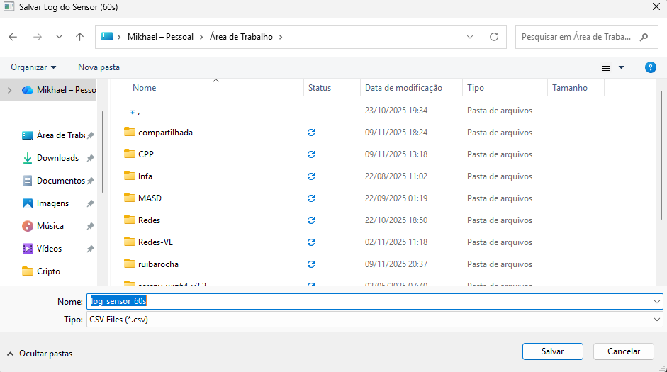

# 📊 Monitor de Sensor UDP (Grupo 6)

Interface gráfica em Python (PyQt6) destinada a receber, processar e exibir dados de um sensor (STM32) enviados via protocolo UDP.

Este projeto recebe pacotes JSON do dispositivo embarcado e atualiza a interface em tempo real, implementando todos os requisitos obrigatórios e bônus do projeto.

## 📸 Visão Geral da Interface

A interface principal é um dashboard em modo escuro, dividido em duas secções:

- **Painel de Destaque (Esquerda):** Focado no valor atual para monitoramento rápido, status e alertas visuais.
- **Painel de Detalhes (Direita):** Fornece o contexto histórico (gráfico e tabela) e os controlos de configuração e exportação.


> Descrição: Uma captura de ecrã (screenshot) da interface gráfica principal (`main.py`) em funcionamento. A temperatura deve estar em estado "Normal" (verde/ciano) e todos os painéis devem estar visíveis (gráfico, tabela, etc.).

---

## ✨ Funcionalidades (Requisitos Cumpridos)

### Requisitos Obrigatórios
- **Monitoramento em Tempo Real:** Exibe o valor atual do sensor com fonte grande e clara.
- **Alerta Visual:** O valor da temperatura muda de cor (vermelho/laranja) se ultrapassar os limites.
- **Histórico Gráfico:** Um gráfico (`pyqtgraph`) exibe os últimos 60 segundos de dados.
- **Salvar Log em CSV:** Um botão ("Salvar Histórico") permite salvar os dados dos últimos 60 segundos num ficheiro `.csv`.

### Requisitos Bônus (Extras)
- **Configuração Dinâmica de Alertas:** O usuário pode alterar os limites de alerta (mínimo e máximo) diretamente na interface.
- **Exportação Automática de Relatórios:** Um checkbox ("Log Automático") salva cada pacote recebido num ficheiro CSV contínuo (`sensor_log_continuo.csv`).
- **Registro de Timestamp:** Cada leitura é registrada com hora exata (`hh:mm:ss`).
- **Indicador Temporal:** Um label ("Última Atualização") mostra o timestamp do último pacote recebido.


> Descrição: Interface em estado de **Alerta**. A temperatura (ex: `34.0 °C`) deve estar em vermelho/laranja e o "Status" deve indicar alerta.

---

## 🚀 Como Executar

### Pré-requisitos
- Python 3.10+  
- Dispositivo STM32 enviando dados via UDP em formato JSON.

### 1️⃣ Configurar o Ambiente

```bash
# Clone o repositório
git clone https://github.com/MkDev21IA/interface_grafica_sensor_temperatura_analogica.git
cd interface_grafica_sensor_temperatura_analogica

# Crie e ative o ambiente virtual
python -m venv .venv

# No Windows (PowerShell)
.\.venv\Scripts\Activate-ps1

# No Mac/Linux
source .venv/bin/activate
```

### 2️⃣ Instalar Dependências
```bash
pip install -r requirements.txt
```

### 3️⃣ Configurar a Rede

Edite o ficheiro `config.ini`:

```ini
[Network]
UDP_IP = 0.0.0.0  # IP do PC ou 0.0.0.0
UDP_PORT = 5000   # Mesma porta do STM32
```

> O código C++ no STM32 deve enviar dados para o IP deste PC (ex: `192.168.1.10`) e para a porta `5000`.

### 4️⃣ Formato JSON Esperado
```json
{
  "group": "grupo6",
  "sensor_id": "SensorDeTemperatura",
  "value": 23.5,
  "unit": "°C",
  "ts": "2025-11-09T21:38:26Z"
}
```

### 5️⃣ Executar
```bash
python main.py
```

### 6️⃣ Salvar o Log

Quando tiver dados suficientes no gráfico, clique em **"Salvar Histórico (60s) em CSV"**.  
Aparecerá uma janela "Salvar Como..." para escolher onde gravar o arquivo.



> Descrição: Captura de ecrã da janela "Salvar Como..." sobre a interface principal após clicar no botão "Salvar Histórico".

# 🏗️ Estrutura do Projeto e Documentação

Para facilitar a manutenção e o entendimento do código, o projeto utiliza uma estrutura organizada e documentação gerada via **Doxygen**.

---

## 📁 Organização do Código

O projeto está dividido da seguinte forma:

- **`main.py`** – Ponto de entrada (launcher) da aplicação. Responsável por iniciar o PyQt e carregar a `MainWindow`.
- **`config.ini`** – Ficheiro de configuração de rede (IP e Porta).
- **`src/`** – Pasta principal do código-fonte.
  - **`src/main_window.py`** – Contém a classe `MainWindow`. Define toda a interface gráfica (layouts, botões, gráfico, tabela) e a lógica de atualização da UI.
  - **`src/udp_listener.py`** – Contém a classe `UDPListener`. É a thread que corre em segundo plano, responsável por escutar a rede, receber os pacotes UDP e emitir os dados para a `MainWindow`.
- **`Doxyfile`** – Ficheiro de configuração usado pelo Doxygen para gerar a documentação.
- **`html/`** – Pasta que contém o site da documentação (resultado do Doxygen).

---

## 🧭 Documentação (Doxygen)

O código-fonte (`.py`) está comentado usando o formato Doxygen, permitindo a geração automática de uma documentação navegável.

### 1️⃣ Como Ver a Documentação

A documentação já foi gerada e está incluída neste repositório.

Basta abrir o ficheiro **`html/index.html`** no seu navegador para explorar as classes, ficheiros e funções do projeto.

---

### 2️⃣ Como Atualizar (Regerar) a Documentação

Se fizer alterações significativas no código (novas funções, classes) e quiser atualizar o site da documentação:

1. Certifique-se de que o **Doxygen** está instalado no seu sistema.  
2. No terminal, na raiz do projeto (onde está o `Doxyfile`), execute:

```bash
doxygen Doxyfile
